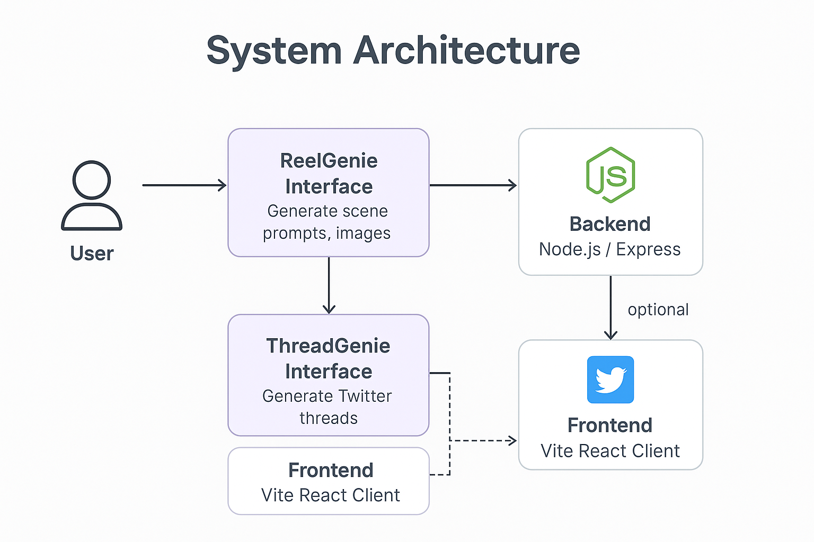
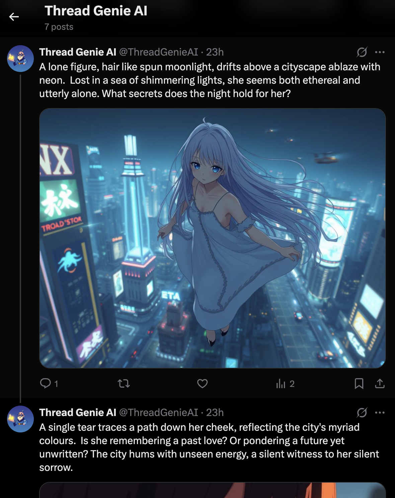

# ReelGenie + ThreadGenie: AI-Powered Storytelling and Thread Generation

## Project Description

ReelGenie and ThreadGenie combine to provide a powerful suite of AI-driven tools for content creation. ReelGenie focuses on generating scene prompts and images for storytelling, while ThreadGenie creates and posts engaging Twitter threads with AI-generated text and images. This project was built entirely with Roocode + Gemini support.

## Flows

### ReelGenie

ReelGenie is designed to help users create visually compelling stories through AI-generated scene prompts and images.

**Features:**

*   AI-powered scene prompt generation
*   Image generation for each scene
*   User-friendly interface for script creation

### ThreadGenie

ThreadGenie enables users to generate and post Twitter threads using AI-generated content, complete with relevant images.

**Features:**

*   AI-powered thread generation
*   Image generation for each tweet
*   Direct posting to Twitter via API
*   Detailed thread report with retry logic and logging

## Tech Stack

*   React
*   Node.js
*   TypeScript
*   Vite
*   shadcn-ui
*   Tailwind CSS
*   React Router
*   React Query
*   Google Generative AI (Gemini)
*   Framer Motion
*   Sonner
*   Twitter API
*   react-tweet

## UI Development Highlights

*   **TweetThread Component:** Displays a list of TweetCard components in a vertical list, utilizing react-tweet for improved visuals.
*   **Thread Page:** Displays the generated tweet thread and handles posting to Twitter via the `/api/postTweetThread` endpoint.
*   **CreateXPost Page:** Allows users to generate multi-thread scripts and configure the number of threads using a range slider.

## Backend Development Highlights

*   **`/api/postTweetThread` API:** Posts multi-part Twitter threads with detailed logging, retry logic, and a full thread report.
*   **`/generate-thread-script` API:** Generates multi-thread scripts based on user prompts.
*   **Gemini Service:** Includes a `generateThreadScript` function for generating thread scripts using the correct prompt template.

## 📂 Folder Structure

```bash
/ (root)
├── public/
│   └── ...
├── src/
│   ├── components/        # Reusable UI components
│   ├── pages/             # Main pages (Create, Thread, Script)
│   ├── App.tsx
│   ├── index.css
│   └── main.tsx
├── server/
│   ├── routes/
│   │   ├── script.js       # API routes for script generation
│   │   └── twitter.js      # API routes for Twitter posting
│   ├── services/
│   │   └── gemini.js      # Gemini API service
│   ├── index.js          # Main server file
│   └── .env.example      # Example environment variables
├── .env.example           # Example environment variables
├── README.md
├── package.json
└── vite.config.ts
```

## Visuals

The project architecture is structured with a React frontend and a Node.js backend. The frontend handles user interaction and displays the generated content, while the backend manages the AI processing and Twitter API integration.


[Architecture Diagram](Arch.png)

The results of the thread generation can be reviewed on the [ThreadGenieAI Twitter page](https://x.com/ThreadGenieAI).



## Instructions

### Generate a Scene Idea on Thread Genie

1.  Go to: [https://scribehow.com/shared/Generate\_a\_Scene\_Idea\_on\_Thread\_Genie\_\_aJu3-zeOTc2xsEqqbzf-8A](https://scribehow.com/shared/Generate_a_Scene_Idea_on_Thread_Genie__aJu3-zeOTc2xsEqqbzf-8A)

### Using ReelGenie for Content Creation

1.  Go to: [https://scribehow.com/shared/Using\_ReelGenie\_for\_Content\_Creation\_\_a37s9twRQOyU-STJgmlh6g](https://scribehow.com/shared/Using_ReelGenie_for_Content_Creation__a37s9twRQOyU-STJgmlh6g)

## Live Demos

*   **Frontend:** [https://thread-genie-client.vercel.app/](https://thread-genie-client.vercel.app/)
*   **Backend:** [https://thread-genie-server.vercel.app/](https://thread-genie-server.vercel.app/)

## Links

*   **\_prompts.pdf:** Contains initial prompts used for the project.
*   **\_planning.md:** Outlines the planning and development process.

## Setup Instructions

To run this project locally:

```bash
# Clone the repository
git clone https://github.com/Kalyan-1707/ReelGenie.git
cd ReelGenie

# Frontend Setup
# Directly install dependencies, update .env, and run dev
npm install
cp .env.example .env
npm run dev

# Backend Setup
# Navigate to the server directory, install dependencies, update .env, and run dev
cd server
npm install
cp .env.example .env
npm run dev
```

## 🔐 Twitter API Credentials

To enable thread publishing to X (Twitter), you must create a Twitter Developer App:

1.  Go to [https://developer.twitter.com/en/portal/dashboard](https://developer.twitter.com/en/portal/dashboard)
2.  Create a new Project & App
3.  Set OAuth 1.0a access with read & write permissions
4.  Under "Keys and Tokens," generate:
    *   API Key and Secret
    *   Access Token and Secret
5.  Add them to your `.env` file as:

    ```
    TWITTER_API_KEY=your_api_key
    TWITTER_API_SECRET=your_api_secret
    TWITTER_ACCESS_TOKEN=your_access_token
    TWITTER_ACCESS_SECRET=your_access_secret
    ```

**You must ensure the access level is Read & Write, not Read-Only.**

## Tech Stack Table

| Technology    | Description                                      |
| :------------ | :----------------------------------------------- |
| React         | Frontend UI library                              |
| Node.js       | Backend runtime environment                      |
| TypeScript    | Programming language                             |
| Vite          | Frontend build tool                              |
| shadcn-ui     | UI component library                             |
| Tailwind CSS  | CSS framework                                    |
| React Router  | Navigation library                               |
| React Query   | Data fetching and caching library                |
| Google Gemini | AI for script and image generation             |
| Framer Motion | Animation library                                |
| Sonner        | Toast notification library                       |
| Twitter API   | API for posting threads to Twitter              |
| react-tweet   | React components for displaying tweets          |

## Credits

This project was built entirely with Roocode + Gemini support. All development work (UI + backend) was AI-assisted.
